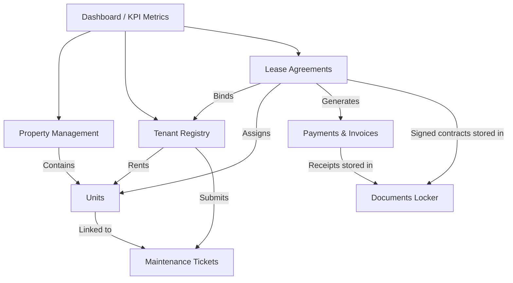
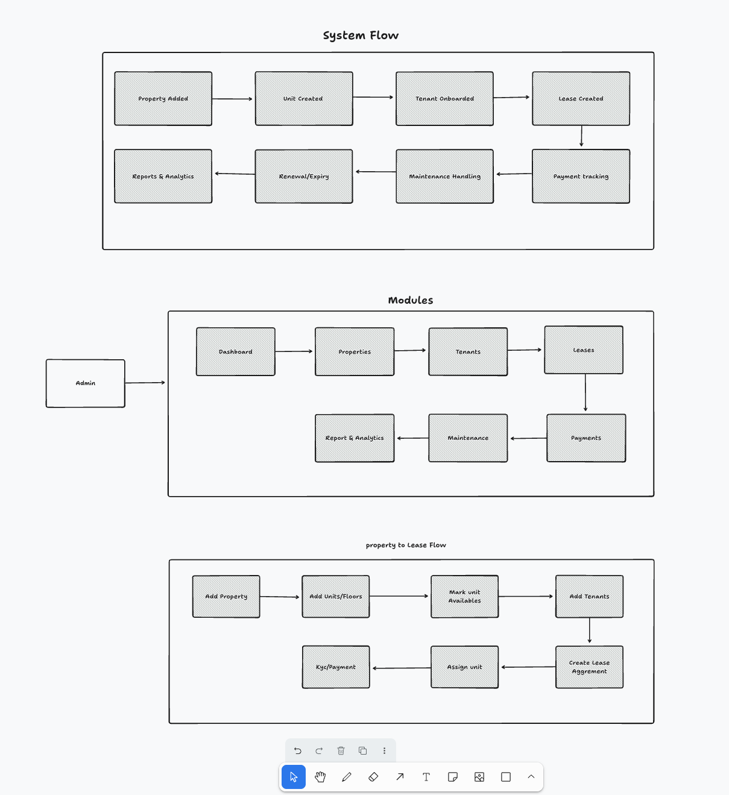

# 🏢 LeaseFlow — Enterprise Lease Management System

LeaseFlow is a modern, production-grade, single-tenant Admin Dashboard designed for property managers to streamline property listings, tenant onboarding, lease agreements, billing, and maintenance operations.

Designed with **React 19 + TypeScript**, **Vite 8**, **SCSS Modules**, and **Zustand**, it simulates a complete cloud-based SaaS dashboard with reactive mock data.

---

## 🗺️ System Architecture & Structural Flow

Below is the conceptual flow of the LeaseFlow platform, illustrating how data propagates through the application.



### 🖼️ Detailed Flow Diagram
The structural flow of the admin panel is visualized below:



---

## 📑 Domain Research & The "Best Sequence" Workflow

Our research indicates that administrative overhead in property management arises from fragmented datasets. To solve this, LeaseFlow connects properties, tenants, leases, and tickets into a cohesive, sequential chain.

### The Lifecycle Sequence (The Property Manager's Journey)
1. **Property & Unit Setup**: Onboard new buildings (commercial/residential) and register individual units.
2. **Tenant Registration & KYC**: Profile prospective tenants, store contact details, and review identity verification status.
3. **Lease Drafting**: Connect a tenant to an available unit. Define monthly rent, deposit amount, billing schedule, and upload signed agreements.
4. **Billing & Invoicing**: Once a lease is active, the system automatically schedules monthly rent invoices. Processing payments updates tenant account balances and outputs receipts.
5. **Maintenance & Care**: Tenants or staff report plumbing, electric, or general repairs. Tickets are routed to maintenance lists and assigned to contractors.
6. **Analytics & Audits**: Financial performance, vacancy rates, and ticket turnaround times are compiled into visual reports.

---

## 📊 Modules & Data Shown to the User

Here is the exact data displayed and managed across each panel in LeaseFlow:

### 1. 🎛️ Executive Dashboard (`/`)
* **KPI Metric Cards**: Active Properties, Total Units, Occupancy Rate (%), Expiring Leases, Total Monthly Revenue, Outstanding Balance, and Open Maintenance Tickets.
* **Financial Analytics Chart**: Interactive monthly breakdown comparing **Projected Revenue** vs. **Invoiced** vs. **Actually Collected** amounts using Recharts.
* **Occupancy Trends**: Timeline visualization tracking historical occupancy percentages.
* **Operational Feeds**: Upcoming lease renewals (within 60 days) and recent billing ledger updates.

### 2. 🏢 Property Portfolio (`/properties` & `/properties/:id`)
* **Index Data**: Thumbnail, property type (Residential/Commercial), address, total/occupied units, and average rent.
* **Details Data**: 
  * Unit configuration matrix (Unit #, status, size in sq.ft, monthly rent, and current tenant details).
  * Direct action buttons to Add Property/Unit.
  * Activity log of active leases and unresolved maintenance tickets associated with the building.

### 3. 👥 Tenant Registry (`/tenants` & `/tenants/:id`)
* **Index Data**: Full name, contact details (email/phone), current leased unit, payment status (Paid, Pending, Overdue), and KYC status (Verified, Pending, Failed).
* **Details Data**:
  * Complete profile card + emergency contact details.
  * Active lease details (Start Date, End Date, Rent Amount, Security Deposit).
  * Historical payment log showing invoice IDs, amounts, and dates.
  * Active maintenance tickets raised by the tenant.

### 4. ✍️ Lease Agreements (`/leases` & `/leases/:id`)
* **Index Data**: Lease ID, Tenant name, Property & Unit, Term length, Monthly rent, Deposit, and status (Active, Pending, Expired, Terminated).
* **Details Data**:
  * Active progress bar showing elapsed lease duration.
  * Chronological timeline of the lease (Signed -> Active -> Renewed/Terminated).
  * Connected legal documents (e.g. signed PDFs).

### 5. 💳 Payments & Invoices (`/payments`)
* **Index Data**: Invoice ID, Tenant name, billing period, total due, payment date, and transaction status (Paid, Unpaid, Overdue).
* **Actions**: Open invoice modal to pay balances using digital wallets, bank transfers, or credit cards. Updates the Zustand store reactively.

### 6. 🔧 Maintenance Board (`/maintenance`)
* **Index Data**: Kanban column categories: **New**, **Assigned**, **In Progress**, and **Resolved**.
* **Details Panel**: Ticket priority (High, Medium, Low), Category (Plumbing, HVAC, Electrical, Appliance), description, photo logs, assigned contractor, and chronological chat update feed.

### 7. 📁 Document Locker (`/documents`)
* **Index Data**: Digital file locker sorting leases, invoices, receipts, and tenant identity documents. Searchable by file type and date uploaded.

---

## 🛠️ Tech Stack & Architecture Highlights

* **React 19 + TypeScript**: Advanced component architecture with strong types for leases, properties, invoices, and tickets.
* **Zustand v5 State Management**: Pushes updates reactively across all modules. For example, paying an invoice automatically updates the associated tenant's status, increases dashboard monthly revenue totals, and drops a receipt PDF in the Document Locker.
* **SCSS Modules**: Scoped stylesheet tokens containing a custom system variables file (`_variables.scss`) supporting custom dark and light themes seamlessly.
* **React Router DOM v7**: Features nested client-side route layouts, persistent sidebar navigation, and loading states.
* **Framer Motion**: Incorporates subtle visual transitions on page change and slide-in drawer modals.

---

## 🚀 Getting Started & Local Development

To run the admin panel locally:

1. Clone or navigate to the directory:
   ```bash
   cd "/Users/priyanshu/Personal/Interview_Tasks/Lease Management"
   ```

2. Install dependencies:
   ```bash
   npm install
   ```

3. Run the local development server:
   ```bash
   npm run dev
   ```

4. Build for production:
   ```bash
   npm run build
   ```
# lease_management
